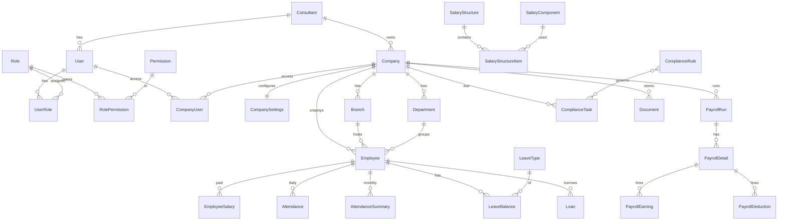

# LabourConsultPro: Architecture

## Layers
```
React SPA (apps/web)  ->  REST /api/v1 (NestJS, apps/api)  ->  PostgreSQL (Prisma)
                                   |-> Redis + queue (bulk payroll, reports, reminders)
                                   |-> Object storage (documents, generated reports)
                                   `-> Backup job (pg_dump daily, retention, verify)
```
Runs unchanged on a local server, VPS, or AWS/GCP/Azure via Docker Compose; config is env-only.

## Tenancy and isolation
`Consultant -> Company -> Branch -> Department -> Employee`. Every company-scoped table has `companyId` + an index.

1. `JwtAuthGuard` (global) authenticates.
2. `PermissionsGuard` checks `@RequirePermissions(...)`.
3. `CompanyAccessGuard` on every `/companies/:companyId/...` route resolves the company **server-side** from what the user may access (`CompanyAccessService`). A foreign company returns 404, not 403.
4. Services always query with the authorised `companyId`. There is no unscoped `GET /employees`.

Access rules: Super Admin = all; Consultant Admin = own consultant's companies; everyone else (staff, client users) = only rows in `company_users`.

## Auth
bcrypt (cost 12) password hashes; 15 min JWT access token carrying role + permission keys; opaque refresh token (stored as SHA-256, rotated on use, reuse of a revoked token revokes all of the user's tokens); lockout after 5 failed logins for 15 min; login rate limit 10/min.

## RBAC
Permissions (`module.action`) and 8 roles are seeded from `src/common/permissions.ts` into `permissions`, `roles`, `role_permissions`. Roles are not hard-coded in controllers, only permission keys.

## Payroll safety (Phase 5 design, schema already in place)
* All formulas/rates live in data: `salary_components`, `salary_structure_items`, `compliance_rules` (versioned, `effectiveFrom/To`, per state).
* A run snapshots the rules it used (`payroll_runs.rulesSnapshot`, `engineVersion`); each `payroll_details` row stores `inputs`, `calculation` trace, `formulaVersion`, timestamp. Old runs never recompute.
* Status: DRAFT -> PROCESSING -> CALCULATED -> REVIEW -> APPROVED -> LOCKED. Unlock needs `payroll.unlock` and always writes an audit log.
* Bulk payroll: one queue job per company, each in its own transaction; failure of one never touches another (`bulk_payroll_items`).
* A single `PayrollEngine` service owns all calculation; controllers only call it.

## Shift management
Off by default (`company_settings.shiftEnabled=false`). Attendance works with Present/Absent/Leave/Weekly Off/Holiday/LOP/OT and never requires a shift. Shift tables are only used when the flag is on; the UI hides shift screens otherwise.

## Audit
`audit_logs` is append-only (no update/delete API; in production grant the app DB role INSERT+SELECT only on it).

## Sensitive data
Bank account, PAN, Aadhaar reference use `*Enc` columns (application-level AES-GCM, key from env/KMS). UI masks by default.

## Roadmap status
| Phase | Status |
|---|---|
| 1 Setup, auth, RBAC, dashboard, company master | API done (auth, companies, settings, dashboard); UI in `apps/web` |
| 2 Branch, Department, Designation, Location, Employee Master | Done (API + UI, encrypted bank/PAN/Aadhaar, masked by default, reveal is permission-gated and audited) |
| 3 Salary components, structures, employee salary | Done (safe formula engine, pure calculator, effective-dated salary with stored snapshot) |
| 4 Attendance, Leave, optional Shift | Done (month grid, validated import with preview/confirm, finalize/reopen lock, leave ledger + accrual + requests + encashment, shift behind a per-company flag) |
| 5 Payroll Engine | Done (pure engine v1.0.0, rule-driven PF/ESI/PT/LWF, OT, arrears/bonus, loans, run workflow DRAFT..LOCKED, unlock audit, bulk payroll). F&F settlement and automatic TDS are not built yet |
| 6 Compliance framework | Done (versioned rule master with tenant-safe ownership, rule validation, calc preview, automatic TDS, registrations, central compliance calendar with statuses, period summaries) |
| 7 Reports, payslips, Excel/PDF/CSV/Print | Done (16 reports, payslip PDF with branding, CSV/XLSX/PDF/JSON/print, export audit, masked bank details) |
| 8 Client portal | Done (user management, client roles limited to their own companies, internal-only routes, sanitised payroll/compliance views, forced password change, portal home) |
| 9-10 | Schema and migration ready; modules to be built phase by phase |

## ERD


## Salary formulas (Phase 3)
Formulas are data, evaluated by a small parser (`salary/formula.ts`), never `eval`. Allowed: numbers, `+ - * /`, parentheses, component codes, `GROSS`, `MIN MAX ROUND FLOOR CEIL`. A structure runs items in sequence order; a formula may use only `GROSS` and earlier components. `calculateSalary()` is pure and deterministic and rounds every line to 2 decimals. Saving a structure dry-runs it, so broken formulas are rejected up front. Assigning salary stores the computed breakup as a snapshot on `employee_salary` and closes the previous record the day before, so later rule edits never change recorded salary or past payroll.

## Attendance, leave, shift (Phase 4)
* `attendance/attendance-summary.ts` is a pure month summariser. Weekly offs and holidays auto-fill; other unmarked days are reported, never guessed. LOP days = absent + unpaid leave + LOP + 0.5 per half day (0 when LOP is disabled). Paid days follow the company method (calendar / fixed 30 / working days) and mid-month joiners or leavers are paid only for employed days. `salaryDivisor` is exposed for the payroll engine.
* Import flow: file parsed in the browser -> `import/validate` stores an `import_jobs` row with errors + staged valid rows -> user reviews -> `import/:id/confirm` writes. Nothing is inserted before confirmation; months that are finalized or have approved/locked payroll are refused at both steps.
* Finalize writes `attendance_summary` (finalized=true) and locks edits. Reopen is blocked while payroll for that month is approved/locked.
* Leave balances are a ledger (`leave_transactions`) with a cached `leave_balances`, updated in one transaction. Accrual is idempotent per month. Approval checks balance, deducts, and writes PAID/UNPAID_LEAVE attendance (source `LEAVE`); cancelling reverses both. One policy per leave type applies to all employees of the company.
* Shift routes return 403 unless `company_settings.shiftEnabled`; the UI hides the menu. Attendance never needs a shift.

## Payroll engine (Phase 5)
* `payroll/payroll-engine.ts` is one pure function per employee: no DB, no clock. Steps: attendance ratio (paid days / salary divisor) -> prorated earnings from the stored salary snapshot -> overtime (HOURLY components: otHours x base/divisor/hoursPerDay x multiplier) -> one-time earnings -> fixed and one-time deductions, loans -> statutory from rules -> totals. Each step is recorded in a trace.
* Statutory (`payroll/statutory.ts`) reads versioned `compliance_rules` only: PF (percent, wage ceiling), ESI (ceiling, rounding), PT (slabs with month overrides), LWF (fixed amounts in listed months). Rule choice: state-specific beats central, then latest effective date, then highest version. An enabled module with no rule produces a warning, never a silent zero.
* Reproducibility: each `payroll_details` row stores the exact `inputs`, the `calculation` trace, `formulaVersion`, and the run keeps a `rulesSnapshot` of the rules used. Later changes to salary or rules do not alter an existing run; only an explicit recalculation (before approval) does.
* Workflow: DRAFT -> (Calculate) CALCULATED -> REVIEW -> APPROVED -> LOCKED. Approve needs `payroll.approve`, lock needs `payroll.lock`, unlock needs `payroll.unlock` plus a written reason and always writes an audit entry. Approved or locked runs cannot be recalculated, and attendance and inputs for that month are frozen. Loan balances are reduced at approval and restored if approval is reversed.
* Employees that cannot be calculated (no salary, attendance not finalized) are listed as ERROR issues and skipped; approval is refused until they are fixed or explicitly acknowledged.
* Bulk payroll runs each company independently (own transactions, try/catch per company) and reports Employees / Success / Errors / Warnings / Status. It currently runs in-process after the request returns; the queue-based worker arrives with deployment hardening.
* Known limits: a salary revised mid-month applies the latest rate to the whole month (warned); PF/ESI wages exclude one-time arrears; no F&F settlement and no automatic TDS yet (enter TDS as an "Other deduction").

## Compliance framework (Phase 6)
* Rule ownership: `compliance_rules.consultantId` is null for platform defaults (maintained by super admins) or set for one consultant's own overrides. A consultant can never read or change another consultant's rules, and a consultant-owned rule beats the platform rule when both are in force (`pickRule`: state-specific, then own, then latest effective date, then version).
* Rules are immutable and versioned. Creating a version validates its shape (`rule-validate.ts`), requires an effective date after the current version, and closes the previous version the day before. Every creation is audited. `POST /compliance/calc-preview` tries a rule on a hypothetical wage without touching payroll.
* TDS is rule-driven: slabs, standard deduction, rebate, cess and financial-year start all come from the rule. Monthly TDS = (annual tax on projected taxable income - TDS already deducted this FY) / months left. Projection = YTD from approved runs + this month's taxable earnings x months left. Simplified: no investment declarations or HRA exemption; prior-month taxable is approximated by gross.
* Calendar: tasks are generated from enabled company modules using `dueDay`/`dueMonthOffset`/`months` stored on the rule (nothing hard-coded). Statuses UPCOMING/DUE_SOON/PENDING/OVERDUE are derived from dates (`computeStatus`) and persisted on read; COMPLETED is manual. Completing a PF/ESI/PT/LWF/TDS filing requires that period's payroll to be APPROVED or LOCKED. The dashboard refreshes statuses before counting.
* Task actions (assign/complete/reopen) resolve the task's company through the same access check as everything else, so another tenant's task looks like it does not exist.

## Reports and payslips (Phase 7)
* Every report is reduced to one shape (`ReportResult`: columns, rows, totals, notes). Pure builders (`reports/builders.ts`) turn prepared data into that shape; renderers turn it into CSV, XLSX, PDF or the on-screen table. On-screen Print uses the browser (sidebar and header are hidden by print styles).
* 16 reports: payroll, salary, wage, deduction, bank statement, OT, PF, ESI, PT, LWF, bonus, gratuity, attendance register, muster roll, leave register, employee ledger. Payroll-based reports read the stored run, so they always match what was calculated; a run that is not approved is marked PROVISIONAL on every format.
* Statutory figures (PF/ESI/PT wages) come from the stored calculation trace, not from recomputation. Gratuity is rule-driven from a GRATUITY compliance rule (`daysPerYear`, `monthlyDivisor`, `minYears`, `roundUpAfterMonths`, `maxAmount`); with no rule the report shows service and wages only.
* Safety: CSV text cells that start with = + - @ get an apostrophe (formula injection); XLSX text is always a text cell; downloads set `Content-Disposition: attachment` and `nosniff`. Downloads need `reports.export`; every export and payslip generation is audited. Bank statements show masked account numbers unless the caller has `employee.sensitive`, and full-number exports are audited separately.
* Payslips: one A4 page per employee, company colour/title/footer configurable in company settings, amount in words (Indian numbering), DRAFT watermark unless the run is approved or locked.
* Limits: PDF uses built-in fonts (Latin only; the rupee sign prints as "Rs." and other scripts as "?"). Embed a Unicode font before printing Gujarati/Hindi names. PDF and XLSX are capped at 20,000 rows (use CSV). Company logo needs file storage (Phase 9).

## Client portal (Phase 8)
* A client is a user of type CLIENT with `CLIENT_ADMIN` or `CLIENT_HR`, linked to specific companies in `company_users`. Client users hold no firm id (`consultantId` is null), so any code that mistakenly trusts a firm id cannot reach firm data through them. Company access is the same server-side check as everywhere else: another company looks like it does not exist (404).
* `@InternalOnly()` marks routes for the consultant firm only (rule master, calculation preview, bulk payroll, user management, shifts, salary setup is already outside client permissions, attendance finalize/reopen, leave setup and ledger changes). `PermissionsGuard` returns 403 to CLIENT users on them even if a permission were granted.
* Client responses are sanitised: payroll runs drop rule snapshots, engine version, who processed/approved/locked and non-error issues; payroll details drop inputs, calculation trace and warnings; compliance tasks hide assignees; the dashboard hides the audit trail. Bank/PAN stay masked and cannot be revealed.
* User management (`/users`, firm admins only): create firm staff or client users, change role/companies/active, reset password. Roles are checked against the user type (no SUPER_ADMIN via API), companies must be ones the admin can access, you cannot demote or deactivate yourself, and the last active firm admin cannot be removed. Every change is audited and ends the user's refresh tokens; existing access tokens expire within 15 minutes.
* Passwords: admin-issued passwords are one-time (`mustChangePassword`). The token carries the flag and every route except change-password returns 403 `PASSWORD_CHANGE_REQUIRED` until it is replaced. Minimum 10 characters with a letter and a number; changing a password ends all other sessions. Deactivated users cannot refresh.
* Limits: no email delivery yet, so temporary passwords are shown once to the admin to hand over. Document upload by clients arrives with Phase 9.
