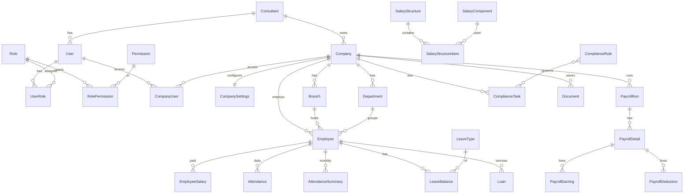

# LabourConsultPro: Architecture

## Layers
```
React SPA (apps/web)  ->  REST /api/v1 (NestJS, apps/api)  ->  PostgreSQL (Prisma)
                                   |-> Redis + queue (bulk payroll, reports, reminders)
                                   |-> Object storage (documents, generated reports)
                                   `-> Backup job (pg_dump daily, retention, verify)
```
Runs unchanged on a local server, VPS, or AWS/GCP/Azure via Docker Compose; config is env-only.

## Tenancy and isolation
`Consultant -> Company -> Branch -> Department -> Employee`. Every company-scoped table has `companyId` + an index.

1. `JwtAuthGuard` (global) authenticates.
2. `PermissionsGuard` checks `@RequirePermissions(...)`.
3. `CompanyAccessGuard` on every `/companies/:companyId/...` route resolves the company **server-side** from what the user may access (`CompanyAccessService`). A foreign company returns 404, not 403.
4. Services always query with the authorised `companyId`. There is no unscoped `GET /employees`.

Access rules: Super Admin = all; Consultant Admin = own consultant's companies; everyone else (staff, client users) = only rows in `company_users`.

## Auth
bcrypt (cost 12) password hashes; 15 min JWT access token carrying role + permission keys; opaque refresh token (stored as SHA-256, rotated on use, reuse of a revoked token revokes all of the user's tokens); lockout after 5 failed logins for 15 min; login rate limit 10/min.

## RBAC
Permissions (`module.action`) and 8 roles are seeded from `src/common/permissions.ts` into `permissions`, `roles`, `role_permissions`. Roles are not hard-coded in controllers, only permission keys.

## Payroll safety (Phase 5 design, schema already in place)
* All formulas/rates live in data: `salary_components`, `salary_structure_items`, `compliance_rules` (versioned, `effectiveFrom/To`, per state).
* A run snapshots the rules it used (`payroll_runs.rulesSnapshot`, `engineVersion`); each `payroll_details` row stores `inputs`, `calculation` trace, `formulaVersion`, timestamp. Old runs never recompute.
* Status: DRAFT -> PROCESSING -> CALCULATED -> REVIEW -> APPROVED -> LOCKED. Unlock needs `payroll.unlock` and always writes an audit log.
* Bulk payroll: one queue job per company, each in its own transaction; failure of one never touches another (`bulk_payroll_items`).
* A single `PayrollEngine` service owns all calculation; controllers only call it.

## Shift management
Off by default (`company_settings.shiftEnabled=false`). Attendance works with Present/Absent/Leave/Weekly Off/Holiday/LOP/OT and never requires a shift. Shift tables are only used when the flag is on; the UI hides shift screens otherwise.

## Audit
`audit_logs` is append-only (no update/delete API; in production grant the app DB role INSERT+SELECT only on it).

## Sensitive data
Bank account, PAN, Aadhaar reference use `*Enc` columns (application-level AES-GCM, key from env/KMS). UI masks by default.

## Roadmap status
| Phase | Status |
|---|---|
| 1 Setup, auth, RBAC, dashboard, company master | API done (auth, companies, settings, dashboard); UI in `apps/web` |
| 2-10 | Schema and migration ready; modules to be built phase by phase |

## ERD

